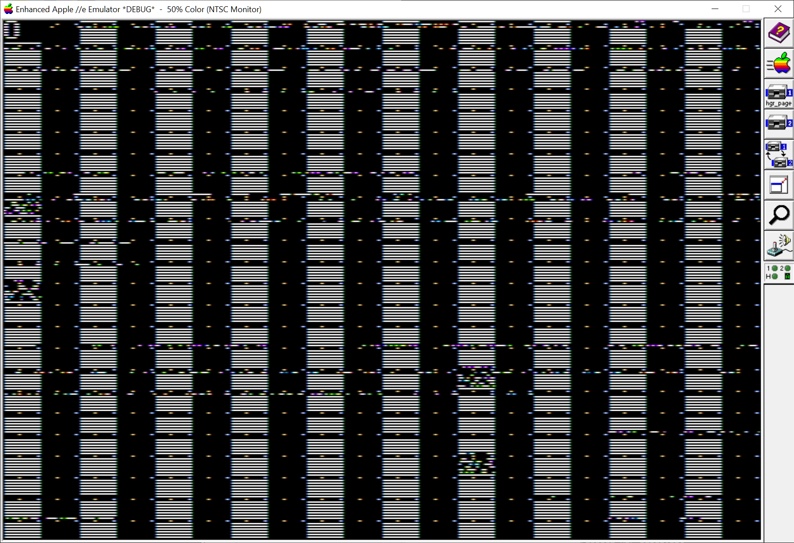
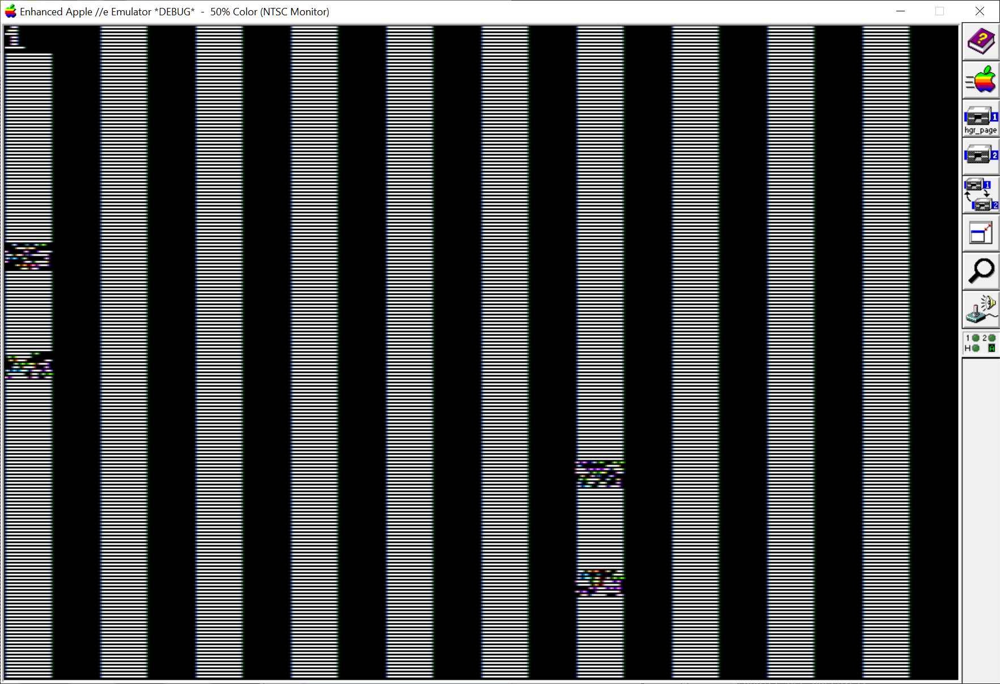
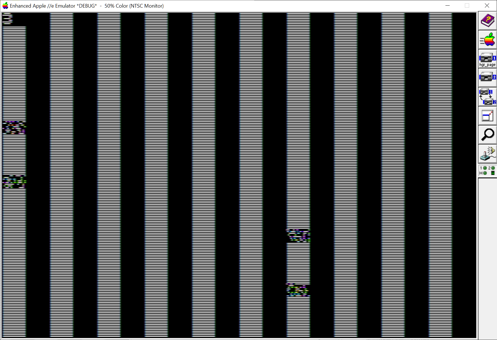
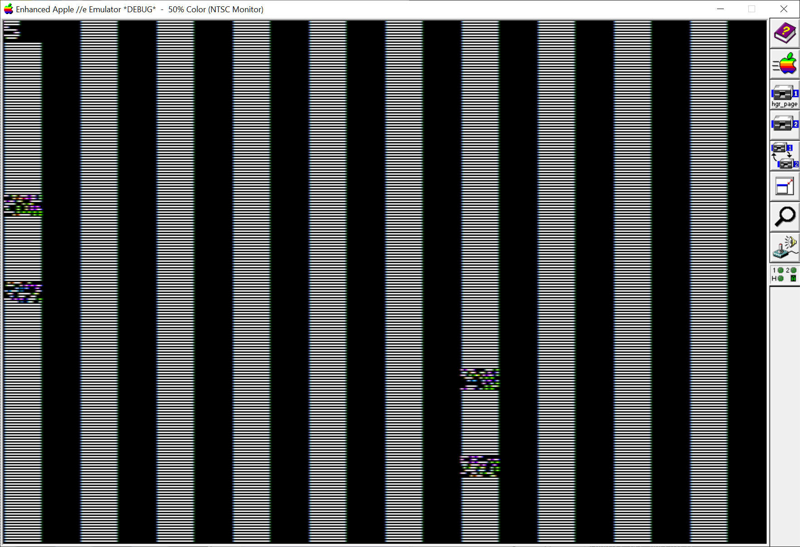
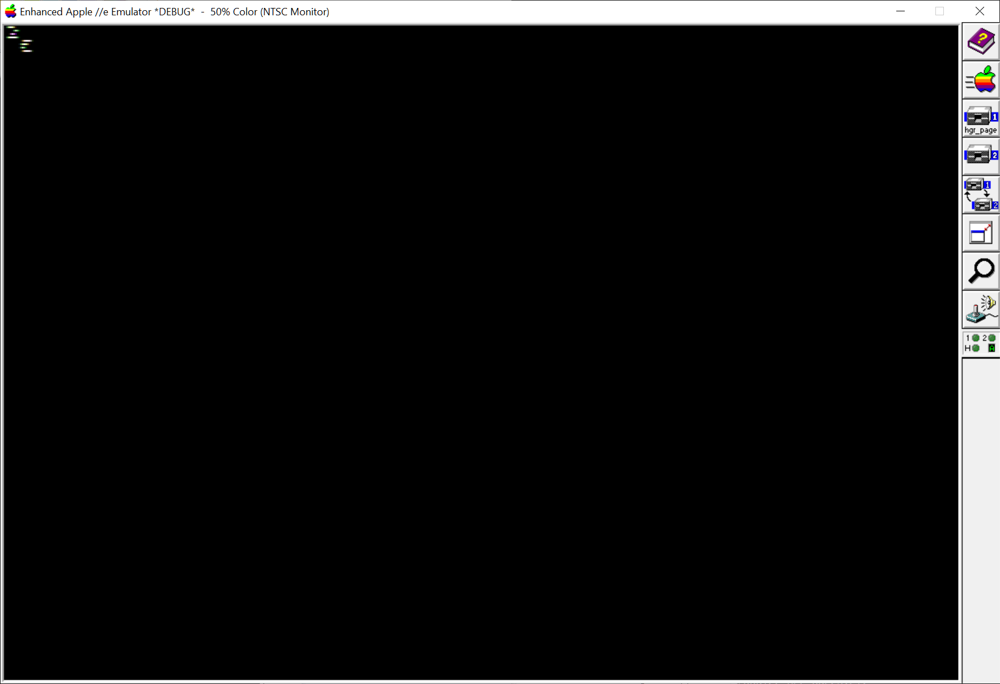

# Apple HGR Pages

This program draws a glyph on every $2000 page to test out HGR visualizers.

* 

* 

* 

* 

* 

* 

* 

* 

* 

# See

* Merlin32 - https://brutaldeluxe.fr/products/crossdevtools/merlin/
* prodosfs - https://github.com/Michaelangel007/apple2_prodos_utils
